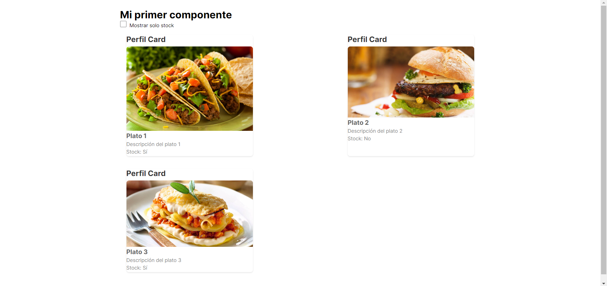

      <h2>
        <a
          href="https://luispinto90.github.io/EjercicioComponentesReact/"
          target="_blank"
          >Componentes de React</a
        >
      </h2>
       

Elaborado con React JS

